# 🐳免费快速搭建Hexo博客网站并部署上线

# 🌴一、Hexo简介

   `Hexo` ==是一个快速、简洁且高效的博客框架== 。基于`Node.js`，它可以帮助您使用`Markdown` (或其他渲染引擎) 轻松创建网站，具有强大的插件系统和主题支持，可以让您构建定制的网站。Hexo的文件结构清晰，可以轻松管理您的内容。它提供了一个强大的命令行界面，可以让您快速开始创建内容，并且它拥有一个强大的API，可以让您在您的工作流程中自定义您的网站构建过程。


官网地址：[https://hexo.io/zh-cn/](https://hexo.io/zh-cn/)
    

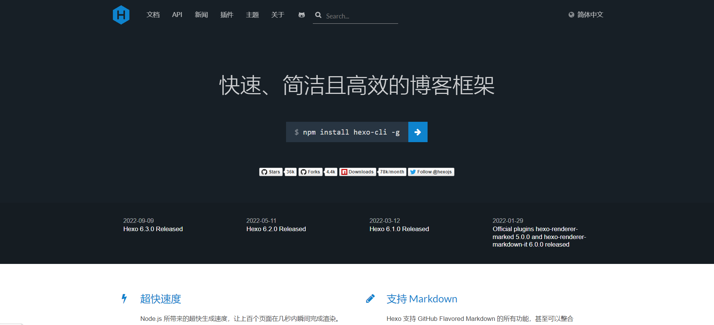

# 🌴二、安装前提


安装 `Hexo` 相当简单，只需要先安装下列应用程序即可：

- [Node.js](http://nodejs.org/) (Node.js 版本需不低于 10.13，建议使用 ==Node.js 12.0 及以上版本==)
- [Git](http://git-scm.com/)

    安装`Node.js`是因为`Hexo` 是基于`Node.js`，而Git是后面部署网站需要，它可以将我们的网站代码(push)推送到服务器上面去。


## 🧊1、安装Node.js

官方网站：[https://nodejs.org/en/](https://nodejs.org/en/)

中文官方网站：[http://nodejs.cn/g)](http://nodejs.cn/)

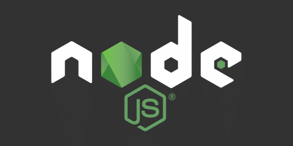


安装过程比较简单，可以参考文章👉[Node.js详细安装教程](https://www.runoob.com/nodejs/nodejs-install-setup.html)

如果你是从事IT相关行业，经常与 `Node.js`打交道，不妨试下`nvm`安装，==它是一个nodejs的版本管理工具==。

`nvm` 安装可以参考文章👉[nvm详细安装教程](https://blog.csdn.net/mjh1667002013/article/details/128943885?spm=1001.2014.3001.5502)

如果你的电脑已经具备 `Node.js` 环境，请直接一下准备`Git`环境。

## 🧊2、安装Git

官方网站：[https://git-scm.com/](https://git-scm.com/)

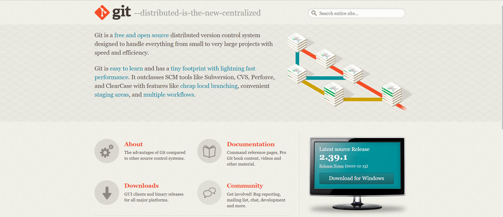

    安装过程同样简单，下载安装即可，可以参考文章👉[Git详细安装教程]()，已有Git环境直接跳过这步。

## 🧊3、检查node和Git环境

    打开`cmd`查看：

```java
//查看node版本信息
node -v
//查看Git版本信息
 git --version
```

    出现版本信息则表示环境没问题。

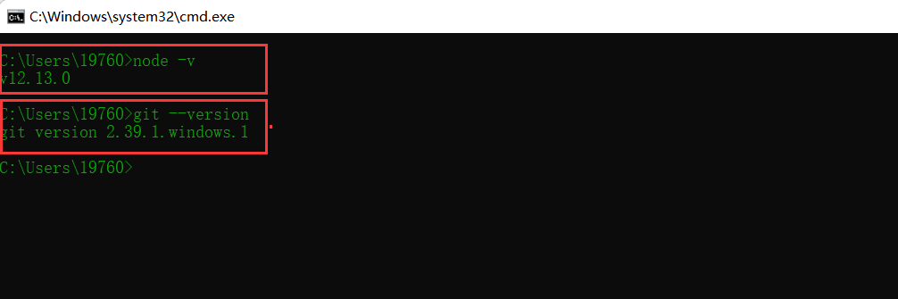

# 🌴三、安装Hexo

随便准备一个test文件夹，cmd进去。

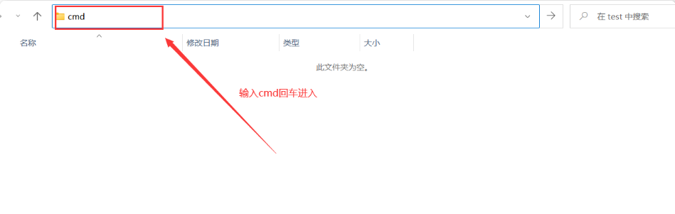

1. 全局安装`hexo-cli`

```css
npm install -g hexo-cli
```

2. 安装 `Hexo` 完成后，请执行下列命令，`Hexo` 将会在指定文件夹中新建所需要的文件。

```css
hexo init blog
```

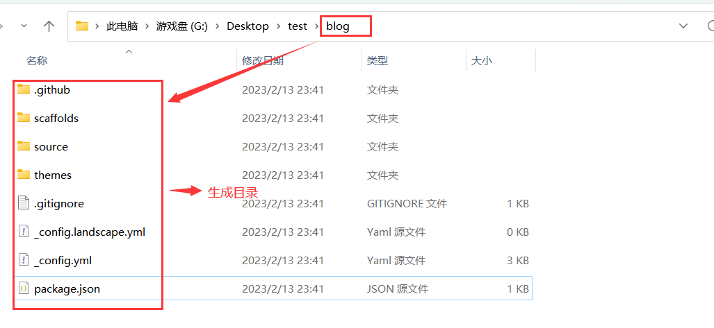

3. 安装依赖

```css
cd blog
npm install
```

安装完后会生成一个依赖包文件夹和一个依赖包相关信息`json`文件。
    

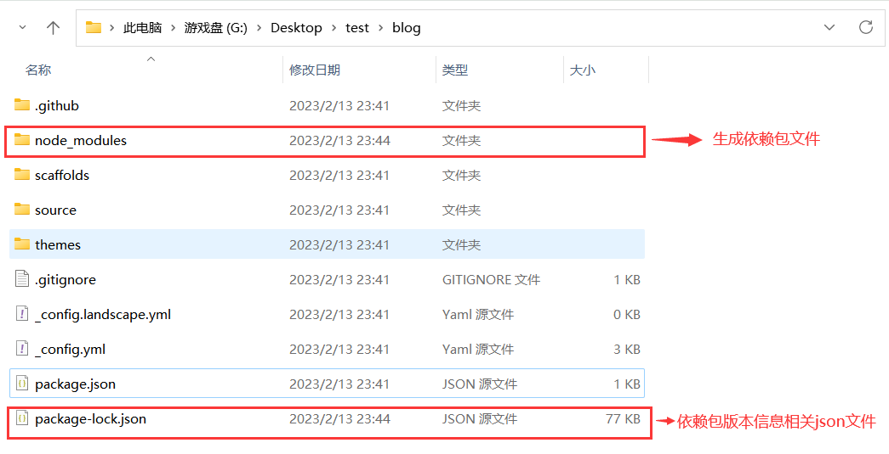

最后一步，使用`hexo s`	启动，并访问[http://localhost:4000/](http://localhost:4000/)。

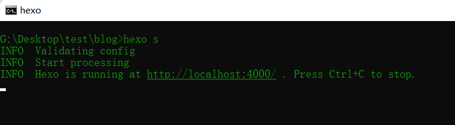

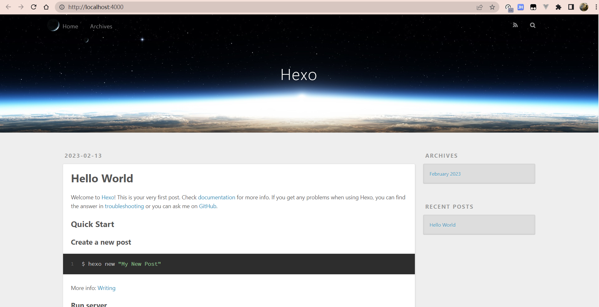

    安装完毕，就是这么简单，快速、简洁且高效的`Hexo`博客框架，当然现在的博客还只是最初始的模样，后续我们可以使用主题来美化它，填充自己的博客内容来丰满它，让你的个人博客变得万人瞩目!

    接下来我们来了解几个常用命令。

# 🌴四、常用相关命令

1. `init`：初始化文件夹。如果没有设置 `folder` ，`Hexo` 默认在目前的文件夹建立网站。

```css
hexo init [folder]
//例如：
hexo init blog
```

2. `new`：新建一篇文章，如果标题包含空格的话，请使用引号括起来。

```css
hexo new "title"
```

3. `generate`：生成静态文件。

```css
hexo generate
//该命令可以简写为：
hexo g
```

4. `server`：启动服务器。默认情况下，访问网址为： `http://localhost:4000/`。

```css
hexo server
//简写为
hexo s
```

5. `deploy`：

```css
hexo deploy
```

6. `version`：显示 `Hexo` 版本。

```css
hexo version
```

上面便是常用的几个命令，已经够用了，当然命令还不止这些，其他命令在后面开始写作时再深入全面学习。

# 🌴五、快速部署到Github服务器

## 🧊1、什么是Github？

​		`GitHub`是一个开源的版本控制系统，可以用来存储和跟踪代码以及文档的变化，并且可以与其他开发者共享项目。它使用`Git`本地存储技术，允许开发人员将代码提交到共享存储库中，以便在变更跟踪和版本控制中发挥作用。`GitHub`也提供了一个`Web`界面，可以让开发者查看代码，分享和管理它们。

​		这就是之前为什么要安装`Git`，正所谓磨刀不误砍柴工，前面我们安装的Git在这里起到关键作用。

## 🧊2、什么是GitHub Pages？

​		`GitHub Pages` 是 `GitHub` 上一项免费的托管服务，它可以让用户将静态网页文件、图片、视频和其他媒体文件托管在 `GitHub` 上，而无需购买虚拟主机或服务器空间。

​		了解什么是`GitHub Pages` 了解接下来部署到Github服务器的原理，为什么我们可以不购买虚拟主机或服务器空间就能够免费部署博客网站，原理就是使用`GitHub Pages` 。

## 🧊3、什么是Gitee Pages？

​		`Gitee Pages`是码云提供的免费托管静态网页的服务。它可以让你将自己的静态网页托管在码云上，免费发布个人博客、项目介绍、文档等内容。

> ​		GitHub Pages和Gitee Pages其实是一个东西，为什么讲了GitHub Pages还有讲Gitee Pages，因为GitHub的服务器位于国外，如果你没有梯子或者插件加速可能会访问慢，而Gitee号称国内版的GitHub，在国内当然访问快，所以这里提供了第二种方案，部署到Gitee上面去。

## 🧊3、注册Github

官网地址：[https://github.com/](https://github.com/)


​		邮箱注册即可，因为Github官网服务器位于国外，所以有时间访问有点慢很正常，解决的办法通常可以使用梯子（`vpn`）或者浏览器Github加速插件来加速。

## 🧊4、创建Github仓库

首先在首页点击创建仓库。

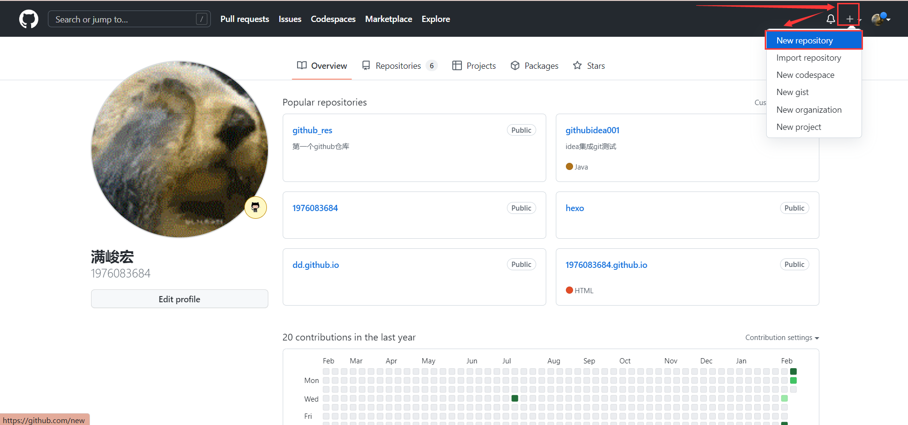

进入里面输入仓库名后点击创建。

仓库名创建规则：`用户名.github.io`，必须是用户名加github.io后缀，因为我们使用的是Github pages。

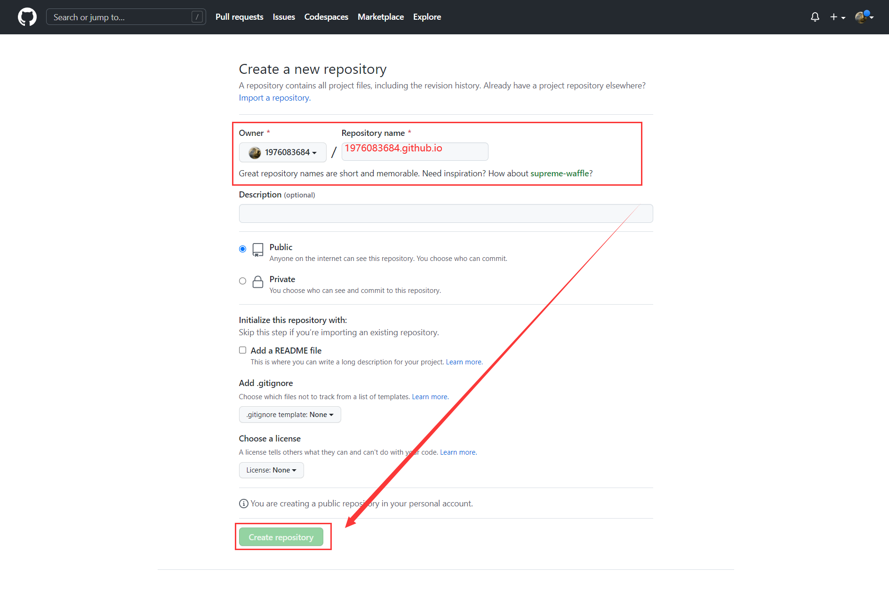

​		创建完后进入该仓库，可以看到`HTTPS`地址：[https://github.com/1976083684/1976083684.github.io.git](https://github.com/1976083684/1976083684.github.io.git)，后面会使用Git通过该地址将代码上传到此处，所以刚创建的仓库是没有下面的内容。

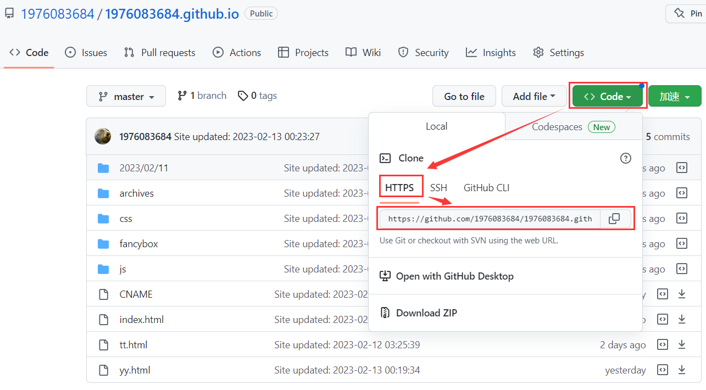

## 🧊5、一键部署

> 回到我们当初安装时的cmd界面，部署的操作都在上面进行。

首先安装 [hexo-deployer-git](https://github.com/hexojs/hexo-deployer-git)。

```css
npm install hexo-deployer-git --save
```

第二步在`_config.yml`文件中添加配置。

```yml
deploy:
  type: git
  repo: https://github.com/1976083684/1976083684.github.io.git
  branch: master
```

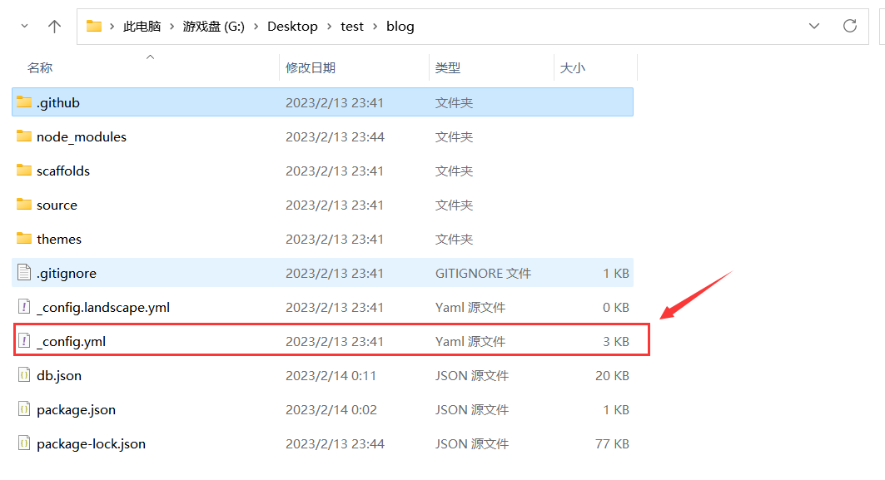 	·

第三步生成静态文件。

```css
hexo g 或者 hexo generate
```

最后一步部署。

```css
hexo d 或者 hexo deploy
```

部署完后，在Github查看上传的代码，并访问[1976083684.github.io](https://1976083684.github.io)即可在线访问博客网站！

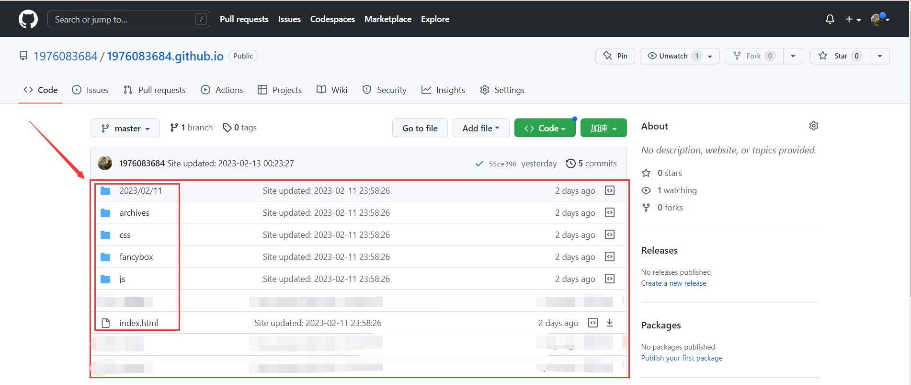

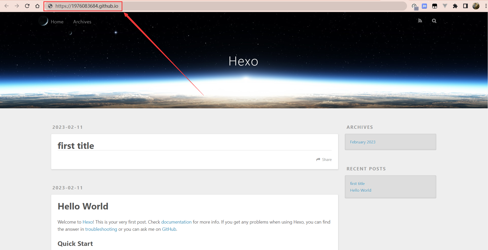


---

