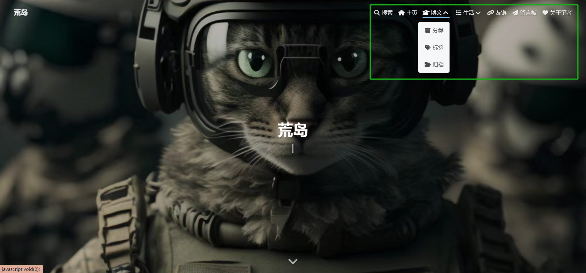
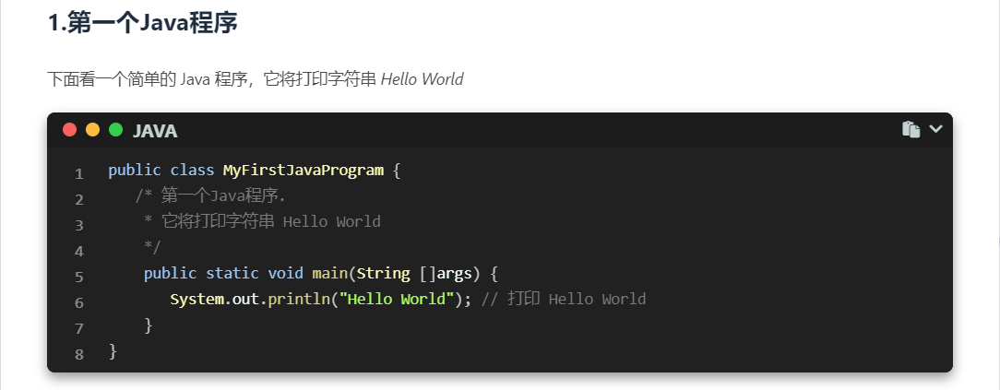
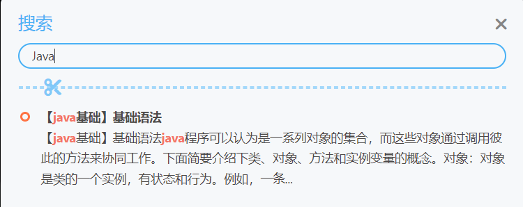
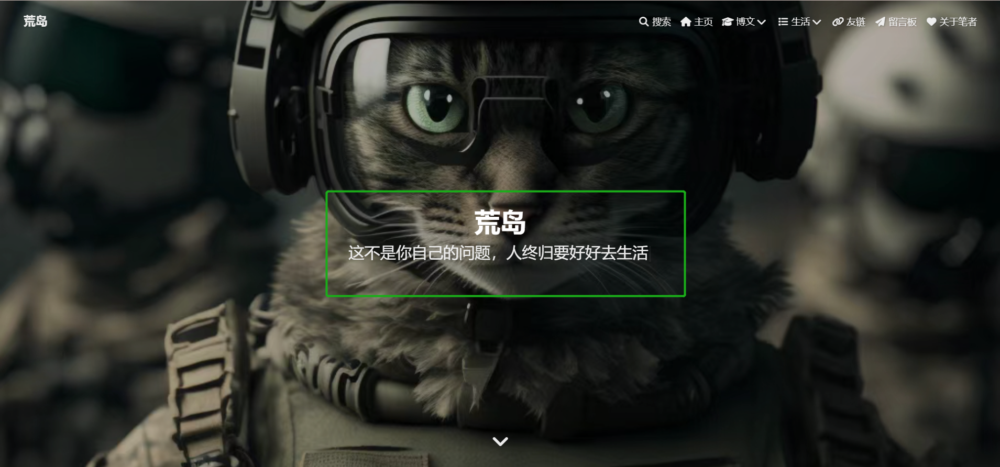
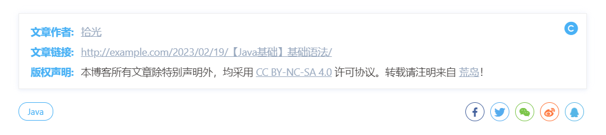
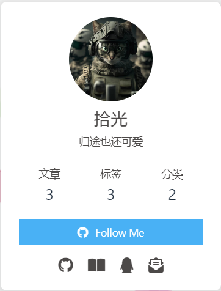
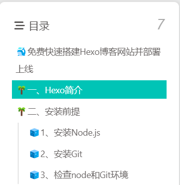
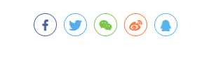

# 🐳Hexo搭建Butterfly主题并快速美化

上篇文章[《快速搭建Hexo博客网站并部署上线》](./Hexo博客网站搭建.md)讲述了如何快速搭建个人博客，部署到Github上线并且能够通过网址访问，但是它的样式是最初始的状态，不够美观，本篇文章讲述如何搭建Butterfly主题并快速美化我们的个人博客，好看的样式所产生的观感会让你在阅读时有一种心情愉悦的感觉。

## 🧊1、安装butterfly主题

1. 在`hexo`项目根目录下下载主题。

```css
git clone -b master https://github.com/jerryc127/hexo-theme-butterfly.git themes/butterfly
```

2. 安装`pug` 和 `stylus` 渲染器。

```css
npm install hexo-renderer-pug hexo-renderer-stylus --save
```

3. 修改项目根目录下的`_config.yml`文件（称为站点配置文件），开启主题。

```yml
# Extensions
## Plugins: https://hexo.io/plugins/
## Themes: https://hexo.io/themes/
theme: butterfly
```

4. 升级建议

为了減少升级主题带来的不便，我们可以把主题文件夹中的 `_config.yml` 重命名为 `_config.butterfly.yml`，复制到 `Hexo` 根目录下与`_config.yml`同级。

Hexo会自动合并主题中的`_config.yml`和 `_config.butterfly.yml` ，如果存在同名配置，会使用`_config.butterfly.yml`的配置，其优先度较高。所以像和博客网址相关联的固定资料可以设置在`_config.yml`中，比如博客的标题、作者信息和邮箱等等资料，而和主题样式相关的配置放在 `_config.butterfly.yml` 中，那么在将来你想换一个主题是很方便的。


## 🧊2、设置博客个人资料

修改根目录下的站点配置文件`_config.yml`，可以修改网站各种**资料，例如标题、副标题和语言**等个人资料。

```yml
# Site
title: 荒岛 	#标题
subtitle: ''	#副标题
description: 归途也还可爱		#个性签名
keywords:
author: 拾光	#作者
language: zh-CN	#语言
timezone: Asia/Shanghai    #中国的时区
```

主题支持三种语言：

1. `default(en)`
2. `zh-CN` (简体中文)
3. `zh-TW` (繁体中文)

## 🧊3、导航菜单

修改主题配置文件 `_config.butterfly.yml`

```yml
menu:
  主页: / || fas fa-home
  博文 || fa fa-graduation-cap:
    分类: /categories/ || fa fa-archive
    标签: /tags/ || fa fa-tags
    归档: /archives/ || fa fa-folder-open
  生活 || fas fa-list:
    分享: /shuoshuo/ || fa fa-comments-o
    相册: /photos/ || fa fa-camera-retro
    音乐: /music/ || fa fa-music
    影视: /movies/ || fas fa-video
  友链: /links/ || fa fa-link
  留言板: /comment/ || fa fa-paper-plane
  #留言板: /messageboard/ || fa fa-paper-plane
  关于笔者: /about/ || fas fa-heart  
```

效果图：



## 🧊4、代码块显示设置

1. 在`_config.butterfly.yml`配置文件中可以配置如下功能。

```yml
highlight_theme: mac  #  darker / pale night / light / ocean / mac / mac light / false 代码主题
highlight_copy: true # 复制按钮
highlight_lang: false # 是否显示代码语言
highlight_shrink: false # true: 代码块默认不展开 / false: 代码块默认展开 | none: 展开并隐藏折叠按钮
highlight_height_limit: false # unit: px
code_word_wrap: true #代码自动换行，关闭滚动条
```

同时将站点配置文件`_config.yml`的`highlight`设置为`false`。

```yml
highlight:
  enable: false
  line_number: false
  auto_detect: false
```

**效果图**：




## 🧊5、本地搜索功能

1. 安装搜索插件

```css
npm install hexo-generator-search --save
```

2. 主题配置文件 `_config.butterfly.yml`：

```yml
# Local search
local_search:
  enable: true
  labels:
    input_placeholder: Search for Posts
    hits_empty: "We didn't find any results for the search: ${query}" # 如果没有查到内容相关内容显示
```

**效果图**：



## 🧊6、创建文件夹

1. 分类

```css
hexo new page categories
```

会出现`source/categories/index.md`文件

2. 标签

```css
hexo new page tags
```

会出现`source/tags/index.md`文件：

## 🧊7、修改副标题

1. 修改主题配置文件 `_config.butterfly.yml`:

```yml
# the subtitle on homepage (主頁subtitle)
subtitle:
  enable: true
  # Typewriter Effect (开启打字效果)
  effect: true
  # loop (循環打字)
  loop: true
  # source調用第三方服務
  # source: false 關閉調用
  # source: 1  調用搏天api的隨機語錄（簡體）
  # source: 2  調用一言網的一句話（簡體）
  # source: 3  調用一句網（簡體）
  # source: 4  調用今日詩詞（簡體）
  # subtitle 會先顯示 source , 再顯示 sub 的內容
  source: false
  # 如果有英文逗号' , ',请使用转义字元 &#44;
  # 如果有英文双引号' " ',请使用转义字元 &quot;
  # 开头不允許转义字元，如需要，请把整個句子用双引号包住
  # 如果关闭打字效果，subtitle只会现示sub的第一行文字
  sub:
    - 你在抱怨什么呢
    - 为明天到来的事，说人生像是没有意义
    - 没有选择会是唯一的路
    - 这不是你自己的问题，人终归要好好去生活

```

**效果图：**



## 🧊8、图片设置

图片可以用云链接或者本地路径：`/themes/butterfly/source/img`。修改主题配置文件`_config.butterfly.yml`：

1. 网站图标

```yml
# Favicon（网站图）
favicon: /img/favicon.png
```

2. 头像

```yml
avatar:
  img: /img/avatar.jpg #图片路径
  effect: false #头像会一直转圈  
```

3. 主页封面图片

```yml
# The banner image of home page
index_img: /img/background.jpg
```

4. 文章详情页的顶部图片

当没有在`front-matter`设置`top_img`和`cover`的情况下会显示该图

```yml
# If the banner of page not setting, it will show the top_img
default_top_img: /img/default_top_img.jpg 
```

5. 归档页顶部图片

```yml
#归档子标签页图片
# The banner image of archive page
archive_img: /img/archive.jpg
```

6. `tag`标签页顶部图

```yml
#tag页（标签页）
tag_img: /img/tag_img.jpg
```

7. `category`页顶部图

```yml
#category页
category_img: /img/category_img.jpg
```

8. 统一文章封面

```yml
cover:
  index_enable: true #  是否展示文章封面
  aside_enable: true
  archives_enable: true
  position: both # 封面展示的位置 left/right/both
  # 当没有设置cover时，默认展示的文章封面
  default_cover:
    # 当配置多张图片时，会随机选择一张作为 cover. 此时写法为
    - https:
    - http:
    - http:
    - http:
    - http:
    - http:
```

如果需要为每一篇文章设置不同的封面，可以在文章的`md`文件中添加配置。

```yml
---
title: Hello World        # 标题
tags: [hello]             # 标签
categories:               # 分类
description: hello word~  # 描述
top_img: /img/hello-1.png # 顶部背景图
cover: /img/hello-1.png   # 文章封面
---
```

9. 错误页面

配置了该属性后会替换无法展示的图片

```yml
# Replace Broken Images (替換無法顯示的圖片)
error_img:
  flink: /img/friend_404.gif
  post_page: /img/404.jpg
```

## 🧊9、图片懒加载

1. 新增`hexo-lazyload-image`模块

```yml
npm install hexo-lazyload-image --save
```

2. 在主目录配置文件`_config.yml`增加配置

```yml
lazyload:
  enable: true
  loadingImg: /img/loading.gif
```

这个就是图片没加载出来的时候，出现一个动图转转转的文章页样式

## 🧊10、图片大图查看

修改主题配置文件`_config.butterfly.yml`

```yml
medium_zoom: false
fancybox: true
```

## 🧊11、版权样式

修改主题配置文件`_config.butterfly.yml`

1. 复制的内容后面加上版权信息

```yml
# copy settings
# copyright: Add the copyright information after copied content (複製的內容後面加上版權信息)
copy:
  enable: true # 是否开启网站复制权限
  copyright:  # 复制的内容后面加上版权信息
    enable: false  # 是否开启复制版权信息添加
    limit_count: 50 # 字数限制，当复制文字大于这个字数限制时
```

2. 文章版权信息

```yml
post_copyright:
  enable: true
  decode: true
  license: CC BY-NC-SA 4.0
  license_url: https://creativecommons.org/licenses/by-nc-sa/4.0/
```

效果图：



## 🧊12、相关文章

在文章最下面出现推送

```yml
# Related Articles
related_post:
  enable: true
  limit: 6 # Number of posts displayed
  date_type: created # or created or updated 文章日期顯示創建日或者更新日

```

## 🧊13、打赏

给文章结尾设置打赏按钮，可以放上收款二维码

```yml
# Sponsor/reward
reward:
  enable: true
  QR_code:
     - img: /img/wechat.jpg
       link:
       text: 微信
     - img: /img/alipay.jpg
       link:
       text: 支付宝
```


## 🧊14、侧边栏样式

修改主题配置文件`_config.butterfly.yml`

1. 调整侧边栏出现位置

```yml
aside:
  enable: true
  hide: false
  button: true
  mobile: true # display on mobile
  position: right # left or right 
```

2. 个人信息

```yml
social:
   fab fa-github: https://github.com/ || Github
   fa fa-book-open: https://blog.csdn.net/mjh1667002013 || CSDN
   fab fa-qq:  tencent://AddContact/?fromId=45&fromSubId=1&subcmd=all&uin=728831102&website=www.oicqzone.com || QQ
   fas fa-envelope-open-text: mailto:1976083684@qq.com || Email
```

效果图：



## 🧊15、公告栏设置

修改主题配置文件`_config.butterfly.yml`

```yml
card_announcement:
    enable: true
    content: This is my Blog #修改公告栏信息
```

## 🧊16、Toc目录

修改主题配置文件`_config.butterfly.yml`

```yml
# toc (目錄)
toc:
  post: true
  page: false
  number: false
  expand: true # 是否展开
  style_simple: false # for post
  scroll_percent: true
```



## 🧊17、背景特效/美化

修改主题配置文件 `_config.butterfly.yml`

### ▶️1.鼠标点击的效果

有冒光特效、烟火特效、爱心特效、文字特效，选择其中一个将`enable`设置为`true`就可以。

```yml
# Typewriter Effect (打字效果)
# https://github.com/disjukr/activate-power-mode
activate_power_mode:
  enable: false
  colorful: true # open particle animation (冒光特效)
  shake: true #  open shake (抖动特效)
  mobile: false

# Mouse click effects: fireworks (鼠标点击效果:萤火特效)
fireworks:
  enable: false
  zIndex: 9999 # -1 or 9999
  mobile: false

# Mouse click effects: Heart symbol (鼠标点击效果: 爱心)
click_heart:
  enable: false
  mobile: false

# Mouse click effects: words (鼠标点击效果: 文字)
ClickShowText:
  enable: true
  text:
     - 富强
     - 民主
     - 文明
     - 和谐
     - 平等
     - 公正
     - 法治
     - 爱国
     - 敬业
     - 诚信
     - 友善
  fontSize: 15px
  random: true
  mobile: true
```

### ▶️2.打字效果

```yml
# Typewriter Effect (打字效果)
# https://github.com/disjukr/activate-power-mode
activate_power_mode:
  enable: true
  colorful: true # open particle animation (冒光特效)
  shake: true #  open shake (抖动特效)
  mobile: true
```

### ▶️3.背景特效

```yml
# Background effects (背景特效)
# canvas_ribbon (静止彩带)
# See: https://github.com/hustcc/ribbon.js
canvas_ribbon:
  enable: false
  size: 150
  alpha: 0.6
  zIndex: -1
  click_to_change: false
  mobile: false
# Fluttering Ribbon (动态彩带)
canvas_fluttering_ribbon:
  enable: false
  mobile: false
#星空特效
# canvas_nest
# https://github.com/hustcc/canvas-nest.js
canvas_nest:
  enable: true
  color: '0,0,255' #color of lines, default: '0,0,0'; RGB values: (R,G,B).(note: use ',' to separate.)
  opacity: 0.7 # the opacity of line (0~1), default: 0.5.
  zIndex: -1 # z-index property of the background, default: -1.
  count: 99 # the number of lines, default: 99.
  mobile: false
```

### ▶️4.自定义背景主题色

可以修改部分的UI颜色，没测试过

```yml
# theme_color:
#   enable: true
#   main: "#49B1F5"
#   paginator: "#00c4b6"
#   button_hover: "#FF7242"
#   text_selection: "#00c4b6"
#   link_color: "#99a9bf"
#   meta_color: "#858585"
#   hr_color: "#A4D8FA"
#   code_foreground: "#F47466"
#   code_background: "rgba(27, 31, 35, .05)"
#   toc_color: "#00c4b6"
#   blockquote_padding_color: "#49b1f5"
#   blockquote_background_color: "#49b1f5"
```

### ▶️5.渐变背景

默认显示白色，可设置图片或者颜色
修改主题配置文件`_config.butterfly.yml`：

```css
background:
```

渐变色，步骤：

1）在`\Butterfly\source\css\`目录下创建css文件 `background.css`：

```css
#web_bg {
  background: -webkit-linear-gradient(
    0deg,
    rgba(247, 149, 51, 0.1) 0,
    rgba(243, 112, 85, 0.1) 15%,
    rgba(239, 78, 123, 0.1) 30%,
    rgba(161, 102, 171, 0.1) 44%,
    rgba(80, 115, 184, 0.1) 58%,
    rgba(16, 152, 173, 0.1) 72%,
    rgba(7, 179, 155, 0.1) 86%,
    rgba(109, 186, 130, 0.1) 100%
  );
  background: -moz-linear-gradient(
    0deg,
    rgba(247, 149, 51, 0.1) 0,
    rgba(243, 112, 85, 0.1) 15%,
    rgba(239, 78, 123, 0.1) 30%,
    rgba(161, 102, 171, 0.1) 44%,
    rgba(80, 115, 184, 0.1) 58%,
    rgba(16, 152, 173, 0.1) 72%,
    rgba(7, 179, 155, 0.1) 86%,
    rgba(109, 186, 130, 0.1) 100%
  );
  background: -o-linear-gradient(
    0deg,
    rgba(247, 149, 51, 0.1) 0,
    rgba(243, 112, 85, 0.1) 15%,
    rgba(239, 78, 123, 0.1) 30%,
    rgba(161, 102, 171, 0.1) 44%,
    rgba(80, 115, 184, 0.1) 58%,
    rgba(16, 152, 173, 0.1) 72%,
    rgba(7, 179, 155, 0.1) 86%,
    rgba(109, 186, 130, 0.1) 100%
  );
  background: -ms-linear-gradient(
    0deg,
    rgba(247, 149, 51, 0.1) 0,
    rgba(243, 112, 85, 0.1) 15%,
    rgba(239, 78, 123, 0.1) 30%,
    rgba(161, 102, 171, 0.1) 44%,
    rgba(80, 115, 184, 0.1) 58%,
    rgba(16, 152, 173, 0.1) 72%,
    rgba(7, 179, 155, 0.1) 86%,
    rgba(109, 186, 130, 0.1) 100%
  );
  background: linear-gradient(
    90deg,
    rgba(247, 149, 51, 0.1) 0,
    rgba(243, 112, 85, 0.1) 15%,
    rgba(239, 78, 123, 0.1) 30%,
    rgba(161, 102, 171, 0.1) 44%,
    rgba(80, 115, 184, 0.1) 58%,
    rgba(16, 152, 173, 0.1) 72%,
    rgba(7, 179, 155, 0.1) 86%,
    rgba(109, 186, 130, 0.1) 100%
  );
}
```

2）修改配置文件`_config.butterfly.yml`的引入方式

```yml
# Inject
# 插入代码到头部 </head> 之前 和 底部 </body> 之前
inject:
  head:
     - <link rel="stylesheet" href="/css/background.css">
  bottom:
    # - <script src="xxxx"></script>
```

3）如果背景色不生效，设置`_config.butterfly.yml`

```yml
# Website Background (設置網站背景)
# can set it to color or image (可設置圖片 或者 顔色)
# The formal of image: url(http://xxxxxx.com/xxx.jpg)
background: '#efefef'
```

### ▶️6.`footer` 背景

`footer` 的背景，当设置 `false` 时，将与主题色一致。修改主题配置文件`_config.butterfly.yml`

```yml
# footer是否显示图片背景(与top_img一致)
footer_bg: true
```


## 🧊18、字数统计

1. 安装统计组件

```css
npm install hexo-wordcount --save or yarn add hexo-wordcount
```

2. 修改主题配置文件`_config.butterfly.yml`

```yml
# wordcount (字數統計)
wordcount:
  enable: true
  post_wordcount: true
  min2read: true
  total_wordcount: true
```

效果图：


## 🧊19、文章分享功能

`addThis`、`sharejs`、`addtoany`三个选一个开启

addThis官网：https://www.addthis.com/

```yml
# Share System (分享功能)
# --------------------------------------

# AddThis
# https://www.addthis.com/
addThis:
  enable: false
  pubid:  #访问 AddThis 官网, 找到你的 pub-id

# Share.js
# https://github.com/overtrue/share.js
sharejs:
  enable: true  
  sites: facebook,twitter,wechat,weibo,qq  #想要显示的内容

# AddToAny
# https://www.addtoany.com/
addtoany:
  enable: false
  item: facebook,twitter,wechat,sina_weibo,facebook_messenger,email,copy_link
```

`sharejs`效果图:

