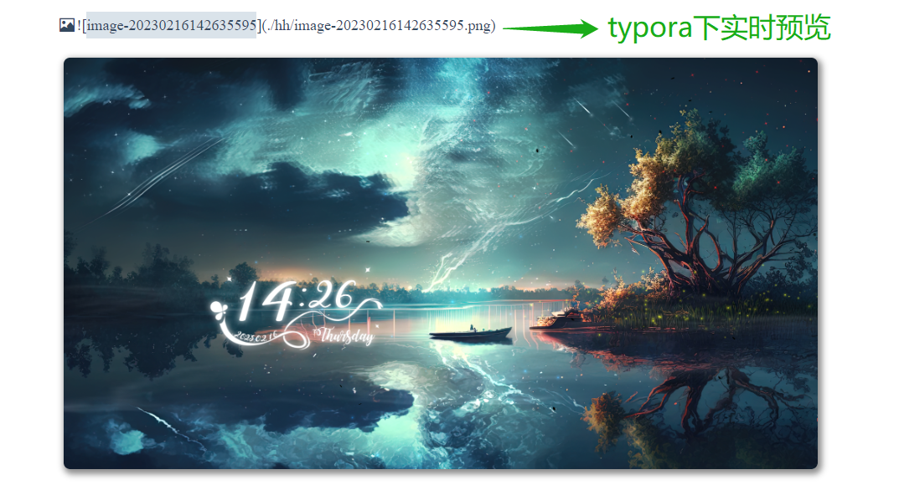
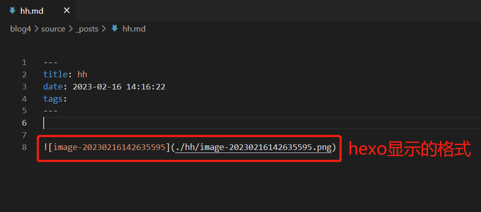
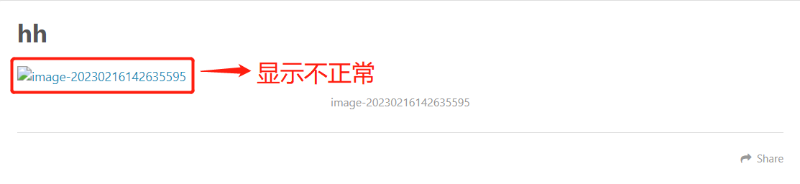
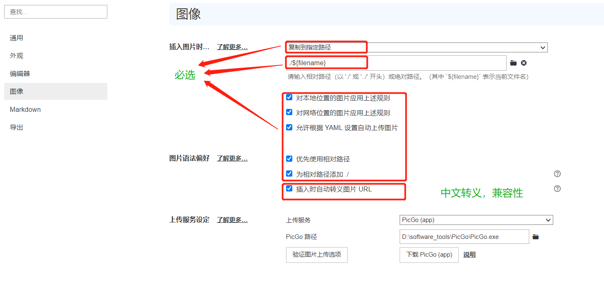
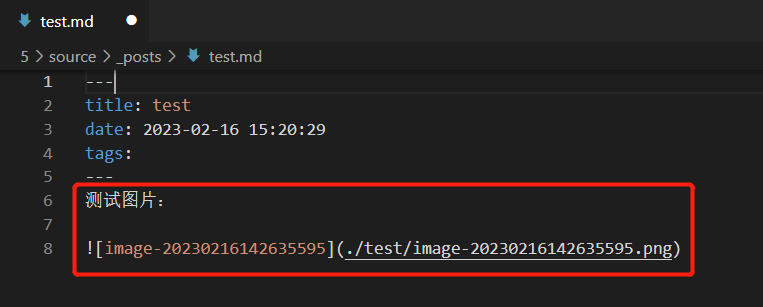
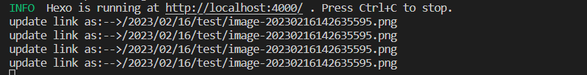
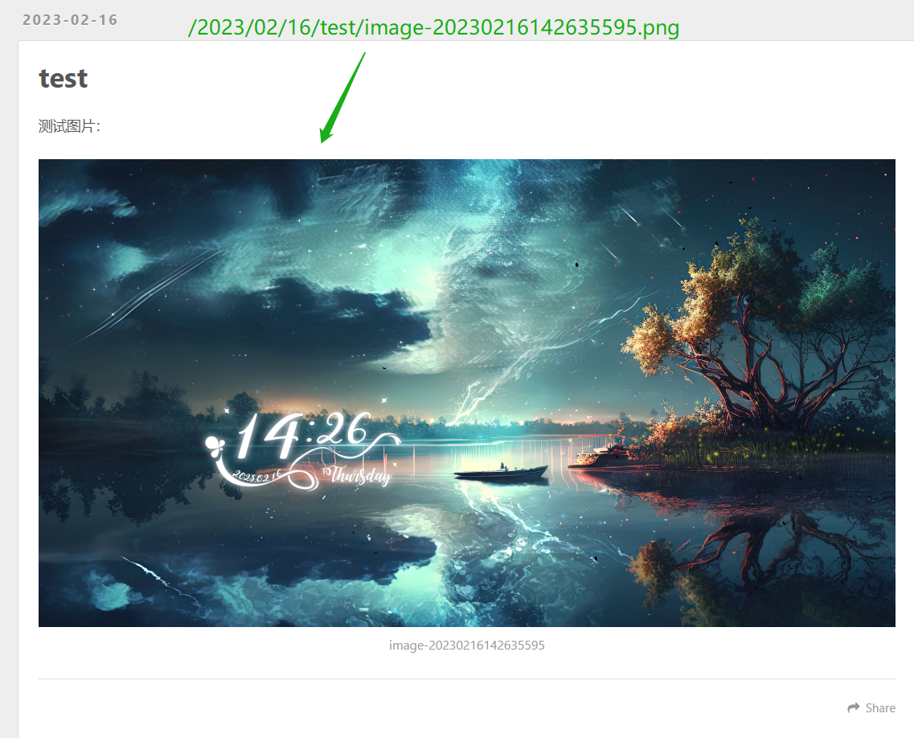

# 🌴Typora图片移植到Hexo显示问题

# 👀一、问题描述

当我们在`Hexo`搭建博客后，将`Typora`中的图片复制到`Hexo`中，不能实时预览，而在`Typora`却能实时预览。



当把图片复制到`hexo`后却不能正常实时预览！





# 📚二、问题分析

​		为什么在 `Typora`下使用`` 引用图片能够实时预览，但需发布到 `Hexo`却不能？

​		在`Hexo 2`时代，社区创建了很多插件来解决这个问题。但是，随着`Hexo 3` 的发布，许多新的[标签插件](https://hexo.io/zh-cn/docs/tag-plugins#引用资源)被加入到了核心代码中。这使得你可以更简单地在文章中引用你的资源。

​		随后[hexo-renderer-marked](https://github.com/hexojs/hexo-renderer-marked) 3.1.0 引入了一个新的选项，将`post_asset_folder`启动为true，启用后，资源图片将会被自动解析为其对应文章的路径。
例如： `image.jpg` 位置为 `/2020/01/02/foo/image.jpg` ，这表示它是 `/2020/01/02/foo/` 文章的一张资源图片， `` 将会被解析为 `` ，从而解决图片显示问题。

```yml
_config.yml
post_asset_folder: true
marked:
  prependRoot: true
  postAsset: true
```

# 🚀三、解决

## 🧊1、Typora配置

首先一定要确保Typora的图片设置，下面配置的目的是为了让我们插入图片时生成``的格式。



## 🧊2、hexo配置

1. 开启`post_asset_folder`：在`_config.yml`配置文件把false改成true。

```css
post_asset_folder: true
```

2. 安装`hexo-asset-image`的依赖

```js
npm install https://github.com/CodeFalling/hexo-asset-image --save	
```

## 🧊3、验证

1. 新建一个test文件,会生成一个`test.md`文件和一个同名的`test`文件夹。

```css
hexo new test
```

2. 复制图片到`test.md`中和`test`文件下:




3. 刷新、生成静态文件、启动

```css
hexo clean
hexo g
hexo s
```

此时我们发现图片已经转换成功-->`/2023/02/16/test/image-20230216142635595.png`，图片成功显示。






