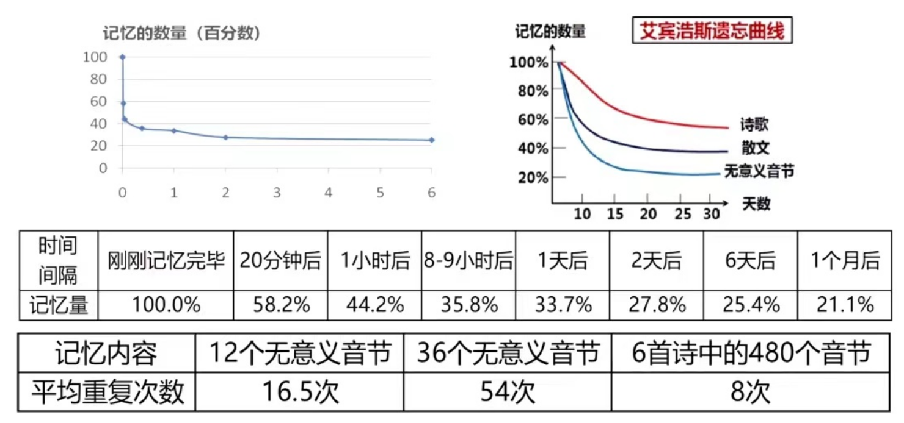

# 🐳高效记忆的三大原理
## 🧊1、魔力之七规律

**观察几个生活例子：**

- 当你翻开手机通讯录时，你会发现11位号码都用空格隔开，分成（3，4，4）段，比如`188 9064 6544`。

- 国外在书写特别长的数字时，一般每三个用一个逗号分隔，比如`1,000,000`。

- 当你注册网站的时候，一般收到的都是`4位或者6位`。

> 为什么验证码一般不超过7位？为什么长的数字要3个4个分为一组？为什么？

因为很多经验发现，这种分段方式是有利于记忆的，美国的心里学家约翰·米勒经过大量的实验发现正常的成年人在记毫无关联的信息的时候，平均一次短时记忆能够记住的数量是`7+-2个`，也就是5到9个左右，这个规律被称为==魔力之七==。一般短时间记忆超过7个毫无关联的信息，在记忆的时候就会相当的难。

很好验证，可以呼叫朋友帮你找14个以上毫无关联的汉字进行验证，比如下面14个无关联汉字。

- 族 同 各 大 结 华 团

- 人 共 国 和 中 胞 民

你可以回想一下自己记住了多少个。

如果将14个汉字重新分段和调整顺序之后是否能一遍记住。

- 中华人民  共和国
- 各族同胞  大团结

> 如何摆脱魔力之七？

就是==长的内容进行分段，没有关联的信息进行关联==，当你建立了联系又适当分组了就可以做到一次的记忆。

生活中背单词时，也尽量不要一次性背太多，可以把每7个或者10个单词分为一组来进行记忆，记完再记下一组。

对于特别长的文章和讲稿，在通读之后，可以进行分段的朗读和记忆，这样记忆效率会变得更高。

**总结：对记忆得内容一定要适当得进行分段和建立联系。** 

## 🧊2、多维记忆规律

先来观察一个例子，下面有多个无关联得词语，看下能记忆多少个：

- 面包	铅笔	裙子	松鼠

- 妈妈	足球	猴子	拐杖

- 乌云	闪电	男孩	电视

有了之前得魔力之七定律，那么相信大家很难在短时间记住7个以上。

> 如何做到一次记住或者记得更多？

在脑海中想一个画面，首先我手里面拿着一个特别松软，散发着诱人得**面包**，面包上插着一根长长得**铅笔**，铅笔晾着一条美丽得**裙子**，裙子下面窜出来一只特别活泼得**松鼠**，松鼠一下跳到了**妈妈**的手里面，妈妈这个时候头顶了一飞过来的**足球**，足球砸到了不远处的一只**猴子**，猴子特比生气，拿起手里面的**拐杖**，拐杖戳了一下黑黑的**乌云**，乌云发出了**闪电**，闪电吓坏了下面的**男孩**，男孩躲到了**电视**后面。

回忆一下脑海中的画面，看能否回忆起12个词语。

> 为什么第二种记忆规律更好记？

因为我们人对于同样一个事物会形成非常多维度的记忆，可能是名词，可能是它的形状，可能是它的香味，比如说你看到苹果两个字的时候，可能会想到一个青青的或者一个红红的苹果；可能想到它散发出来诱人的香味，想到它的味道，甚至你想到它切开之后是什么样子，想到苹果做成了拔丝苹果或者变成了苹果汁。

实际上一个东西有多维的记忆，一般来说文字的，抽象的东西其实不好记忆，但是形象的动感的东西更有利于我们记忆，所以刚才我们把一些名词变成了一些形象，通过动作建立联系之后，就能够做到更好的记忆。 

> 如何利用第二个记忆规律呢？

一定要擅长==把抽象的，不好记的内容变成形象的、动感的、有顺序的、有特点的东西，形成多维度的记忆==，这样你就能够一次性记住大量的内容。

## 🧊3、艾宾浩斯遗忘规律

### 📚3.1、艾宾浩斯遗忘规律

科学家通过大量实验发现，如果你记忆无意义的音节的话，一般在记忆一个小时后会遗忘56%，然后一天后会忘记接近66%的内，遗忘的速度是非常快的，这就是艾宾浩斯遗忘规律。

科学家发现在记忆无意义的内容虽然忘的快，但是在记忆有意义的诗歌、散文等内容会忘的慢一点，并且记忆有意义的内容效率也会更高。

比如说去记忆12个由26个字母随机组成的单词，科学家经过测试发现，12单词是毫无规律的话，一般要重复`16.5`次，记忆36个毫无意义的单词大概要重复`54`次,但是你记6首诗中的480个有音节却只用8次，所以这个事实告诉我们，一定要把知识变得有联系，有意义，这样记的次数会更少，而且会忘得慢一些。

### 📚3.2、高效复习规律

通过艾宾浩斯遗忘规律我们知道遗忘的速度是先快后慢，所以在==复习的时候一定是先密后疏的==，尽量在学完一个小时后或者一天之内安排复习，一般推荐有五个一的复习方案。**学完一个小时、一天、一周、一个月、一个季度之后进行复习，这样记忆会相当的稳固。**

## 🧊4、练习

### 📚4.1、巧记杭州西湖十大景点

三潭印月	柳浪闻莺
雷峰夕照	南屏晚钟
花港观鱼	苏堤春晓
断桥残雪	平湖秋月
曲院风荷	双峰插云

==第一步：进行分组==，我们可以按照一年得四季加上平时就分为五组。

第一组：春季的景象

**苏堤春晓，柳浪闻莺**

第二组：夏季的景象

**曲院风荷，花港观鱼**

第三组：秋天的景象

**雷峰夕照，平湖秋月**

第四组：冬天的景象

**南屏晚钟，断桥残雪**

第五组：平时 

**双峰插云，三潭印月**

==第二步：建立联系==，尽量在脑海中有顺序的用到 一些画面，来把它们结合在一起。

- 第一组：春天的早晨，你来到这个苏东坡修的**苏堤**上面，对应**苏堤春晓**；堤坝上面一般有柳树，柳树上面有很多的黄莺在唱歌，对应**柳浪闻莺**。
- 第二组：柳树下面发现有一片一片圆圆的荷叶，荷叶还在微风的吹拂当中来回的摆动，荷叶旁边还有个院子，对应**曲院风荷**；荷花下面有很多鱼在游来游去，对应**花港观鱼**。
- 第三组：花港旁边有一座雷峰塔正在夕阳的照耀当中形成了一个特别斜的影子，倒映在湖面中，对应**雷峰夕照**；夕阳过后，天气慢慢暗淡下来，月亮就倒映在这个平静的湖面上，对应**平湖秋月**。
- 第四组：一直盯着湖面上的月亮，越来越晚，有种意犹未尽，这个时候突然从南边传来一个钟声，告诉你该回去了，对应**南屏晚钟**；回去的时候不走回头路，会经过一个著名的桥，叫做断桥，断桥上残留很多雪，对应**断桥残雪**。
- 第五组：断桥左右两边有一个高高的山峰插入了云端，对应**双峰插云**；山峰旁边还有三个水潭倒映的月亮，对应**三潭映月**。

### 📚4.2、巧记五十六个民族